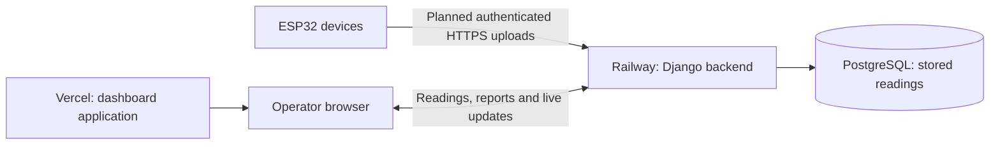

# ZCharMC Monitoring

ZCharMC Monitoring tracks a CO₂ adsorption system: equipment that removes carbon
dioxide from a gas stream. It compares measurements at the inlet and outlet so
operators can inspect system performance and review past readings.

The web dashboard displays CO₂, pressure and other available measurements, charts,
recorded threshold breaches, historical reports and CSV exports. Equipment status
is shown when reported by devices. The dashboard currently provides read-only
monitoring; it cannot operate valves or vacuum actuators.

## How the system works

The selected architecture uses ESP32 devices, a cloud backend and a web dashboard.
No Raspberry Pi is required.

Devices will send readings to Railway, not Vercel. Django validates and stores each
reading in PostgreSQL, then sends live updates to connected dashboards. Browsers
load the dashboard from Vercel and retrieve their data from Railway.

**Physical telemetry integration is still pending.** The active firmware now uses
native ESP-IDF/FreeRTOS with an approved signed OTA release foundation for three
roles. These bench images provide provisioning and updates; native sensor drivers,
telemetry buffering/uploads and the operating control cycle are still pending.
See the [firmware guide](firmware/README.md) before flashing any board. Deploying
the web applications does not update ESP32 devices automatically.

## Repository layout

| Location | Purpose | Runs on |
| --- | --- | --- |
| [frontend/](frontend/README.md) | React, TypeScript and TanStack Start dashboard | Vercel or a development computer |
| [backend/](backend/README.md) | Django API, administration, live updates and database access | Railway or a development computer |
| [firmware/](firmware/README.md) | ESP32 device code and PlatformIO project | ESP32 hardware |
| [docs/](docs/) | Architecture, deployment, maintenance and verification guides | Repository documentation |

## Run it locally

Use Python 3.12 for the backend, PostgreSQL 16, Node.js 24 and Bun 1.3.14 for the
frontend. Docker Compose can provide the local PostgreSQL database.

1. Follow the [backend setup](backend/README.md#local-development) to create the
   local environment, migrate the database and start the API on port 5001.
2. For the existing mock-login dashboard to read a local backend, set
   `ALLOW_PUBLIC_READ=true` in the backend's local `.env`. This makes that backend's
   readings public; use a separate local database containing test data.
3. Follow the [frontend setup](frontend/README.md#local-development) to start the
   dashboard on port 3000. Its local API URL is `http://localhost:5001`.
4. Create labelled test readings using the [verification guide](backend/tools/README.md).
   An empty database will display no readings; deployment does not seed data.

The frontend mock login and Django administration use separate accounts. The mock
login is a demonstration screen and does not authenticate with Django.

## Deployment and maintenance

[Cloud setup](docs/CLOUD_SETUP.md) explains the Vercel frontend, Railway backend,
PostgreSQL connection and future device upload contract. Each hosting project must
be connected to GitHub and the intended deployment branch by its account owner.

GitHub Actions checks pushes and pull requests. The hosting platforms build and
deploy pushed changes through their Git integrations, subject to their configured
branches and build filters. A local commit alone does not deploy anything. Database
migrations must run before the updated backend serves traffic.

Use the [maintenance guide](docs/MAINTENANCE.md) for routine checks, diagnostics,
backups and release verification. See the [verification record](docs/TELEMETRY_VERIFICATION.md)
for completed checks and outstanding work; local tests do not establish what is
currently deployed.

## Current limitations

- **Mock login:** frontend roles are simulated and do not protect backend data.
  With `ALLOW_PUBLIC_READ=true`, readings, reports and exports are publicly readable.
- **Device uploads:** direct HTTPS uploads and durable offline buffering still need
  firmware work. During an internet outage, cloud services cannot receive site data.
- **Equipment control:** remote valve and vacuum actuation is unavailable. Reported
  states are telemetry, not confirmation that a command was executed.
- **Alerts:** threshold breaches are recorded; acknowledgement and resolution are
  not tracked. The alert list covers the latest 100 matching readings.
- **Availability:** this is a monitoring prototype. Free hosting and successful
  simulations do not establish industrial 24/7 availability or equipment safety.
  Sensor units, calibration and operating limits require engineering confirmation.

## Credentials and documentation

Keep real secrets in local environment files or hosting service variables. Never
commit ingestion keys, Django secrets, user tokens or database connection strings
containing passwords. `VITE_*` values are exposed to browser code and must contain
only public configuration, such as the backend's public URL.

These documents contain setup instructions and configuration names, not access
credentials. A README can serve maintainers in either a public or private repository;
it does not require making the repository public.
