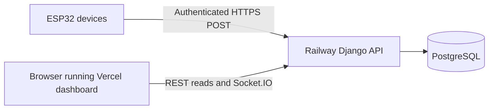

# Direct ESP32 cloud deployment



The browser downloads the dashboard from Vercel, then talks directly to Railway.
Devices upload to Railway only. PostgreSQL has no device-facing or browser-facing
credentials. No Raspberry Pi, local server, or MQTT broker is part of this target.
Firmware is still unchanged and uses its existing MQTT configuration, so deploying
the cloud changes does not start physical device uploads.

## Existing hosting projects

| Setting | Vercel frontend | Railway backend |
| --- | --- | --- |
| Production origin | `https://zcharmc-monitoring.vercel.app` | `https://zcharmcmonitoring-production.up.railway.app` |
| Repository root directory | `frontend` | `/backend` |
| Build | `bun install --frozen-lockfile`, then `bun run build` | Dockerfile `Dockerfile` |
| Before deploy | — | `python manage.py migrate --noinput` |
| Start | Generated Vercel output | `gunicorn config.wsgi:application --config gunicorn.conf.py` |
| Health check | — | `/api/health`, 120-second startup timeout |
| Scale | Managed by Vercel | One replica, one Gunicorn worker |

The frontend's checked-in `vercel.json` already embeds the Railway origin as
`VITE_BACKEND_URL` and enables Git deployments. Keep the actual Vercel Production
variable set to that same value. A changed Vite variable requires a new build.

The backend image enables HTTPS redirects (excluding the internal health probe),
the canonical CORS origin, and the previously approved public demo reads. Explicit
Railway variables override image defaults. The owner should verify these service
variables once; secrets cannot be configured safely through public repository files:

| Railway variable | Value |
| --- | --- |
| `DATABASE_URL` | Reference the existing PostgreSQL service's `DATABASE_URL` |
| `DJANGO_SECRET_KEY` | Existing private random Django secret |
| `DJANGO_DEBUG` | `false` |
| `DJANGO_SECURE_SSL_REDIRECT` | `true` |
| `INGEST_API_KEY` | Private ingestion secret, shared only with authorized uploaders |
| `CORS_ALLOWED_ORIGINS` | `https://zcharmc-monitoring.vercel.app` |
| `ALLOW_PUBLIC_READ` | `true`, preserving the approved demo and mock login |

Keep App Sleeping disabled and use On Failure restarts. The startup health check
confirms database connectivity; it is not continuous uptime monitoring. Keep the
current PostgreSQL service and volume when redeploying the application.

Both projects must track the same intended production branch (`develop` in the
current checkout), have GitHub autodeploy enabled, and have path-based build skips
disabled if every push should rebuild both. GitHub Actions checks every push;
Railway's Wait for CI should be enabled. Local commits need to be pushed to deploy.

Existing `backend/railway.json` is retained for compatibility. Railway currently
[deprecates Config as Code](https://docs.railway.com/config-as-code), with a
2026-12-01 cutoff. For services using dashboard settings, apply the table above
there; merely committing that JSON cannot connect or reconfigure a hosting account.

## Sensor upload contract for the later firmware change

Send one JSON reading to:

```text
POST https://zcharmcmonitoring-production.up.railway.app/api/ingest
Content-Type: application/json
Authorization: Bearer <private INGEST_API_KEY>
```

```json
{
  "node_id": "inlet",
  "message_id": "unique-boot-session:42",
  "timestamp": "2026-10-07T04:00:00Z",
  "co2": 1200,
  "temperature": 28.5,
  "humidity": 65,
  "pressure1": 12.3,
  "pressure2": 11.7
}
```

Sensor node IDs are `inlet` and `outlet`. Available measurements are `co2`,
`temperature`, `humidity`, `ph`, `pm25`, `flow_rate`, `level`, `weight`, `no2`,
`so2`, `pressure1`, and `pressure2`. Omit unavailable measurements or send null;
do not fabricate zeros. At least one finite, non-null measurement is required;
unknown sensor fields are rejected. Timestamps must not exceed server UTC by more
than 60 seconds. See the [sensor units and validity bounds](../backend/README.md#telemetry-validation-and-operations)
for the canonical contract and hardware assumptions that still need confirmation.

For reliable direct uploads, always supply a UTC measurement timestamp and a
message ID unique per node across reboots. Keep both unchanged on retries.
The API keeps these fields optional for legacy compatibility, but omitting them
loses reliable deduplication or original measurement time. Device uptime from
`millis()` is not a UTC timestamp. Synchronize the device clock before sampling.

| Response | Uploader behavior |
| --- | --- |
| `201`, `created: true`, with saved `data.id` | Reading committed; remove it from the local queue |
| `200`, `created: false`, with saved `data.id` | Original reading already committed; remove the retry |
| `400` / `415` | Invalid payload or content type; retain for diagnosis and fix the sender |
| `403` | Missing/incorrect key; stop repeated uploads until credentials are corrected |
| `409` | Same node/message ID has conflicting data; preserve and investigate it |
| Timeout, network failure, `429`, or `5xx` | Retain unchanged payload and retry with backoff and jitter |

The API commits before acknowledging, and publishes new readings to Socket.IO
after commit. A lost response can safely be retried using the same ID. Historical
uploads remain in history/CSV; the dashboard orders them by measurement time and
does not replace its newest values with older arrivals. Reconnect replay does not
add duplicate chart points. Refreshing restores the latest persisted readings.

Without a Pi, offline storage must later be implemented on the ESP32. Cloud
configuration cannot receive readings during a site internet outage. Queue capacity,
flash wear, overflow behavior, clock recovery, TLS certificate verification, and
credential provisioning must be resolved in that firmware phase. The current key
is shared; per-device credentials and rotation remain work before a fleet rollout.
Valve snapshots retain their legacy endpoint behavior; the sensor retry contract
above does not promise deduplication or historical replay for valve snapshots.
Remote valve and vacuum actuation is not implemented by this cloud setup.

## Verification after deployment

From the authorized Railway backend session, run:

```sh
python tools/verify_cloud_flow.py
```

This explicitly inserts six labelled synthetic readings. It checks PostgreSQL,
authenticated ingestion, duplicate retries, live events, history, CSV, and Socket.IO
reconnect recovery. See [the test guide](../backend/tools/README.md) for browser
checks. No automatic seed runs on deploy. Cloud verification does not verify ESP32
connectivity while the firmware is unchanged.
